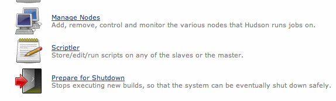
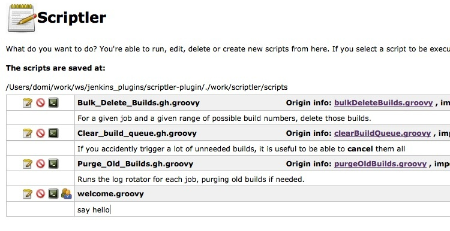
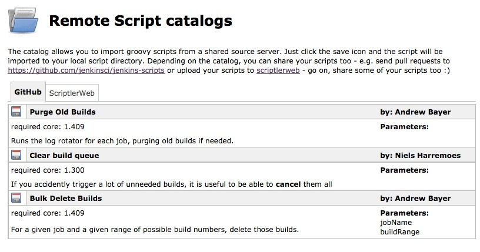
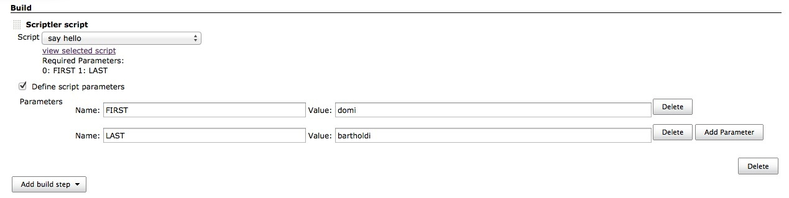
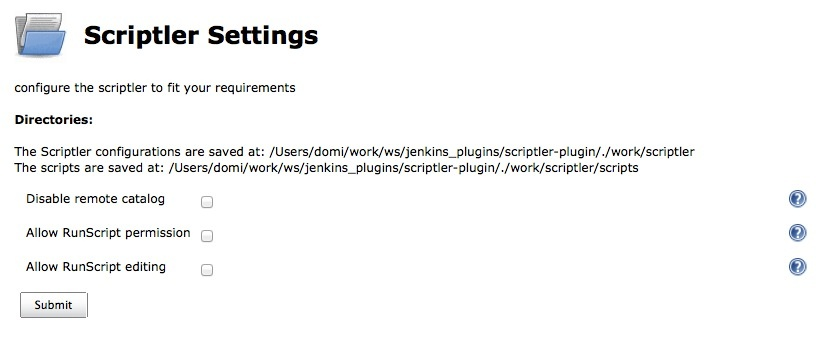

# Scriptler Plugin for Jenkins

Scriptler allows you to store/edit groovy scripts and execute it on any
of the agents/nodes... no need to copy/paste groovy code anymore.

Besides administering your scripts, Scriptler also provides a way to
share scripts between users via hosted script catalogs on the
internet.  
On GitHub at
<https://github.com/jenkinsci/jenkins-scripts/tree/main/scriptler> you
are not only able to find scripts and import it via scriptler in to your
Jenkins instance, but can also share your own scripts. Just send a pull
request to <https://github.com/jenkinsci/jenkins-scripts/> and your
scripts will be available for everyone else too.

# Description

This plugin takes the idea of the script console one step further and
allows you to ease your daily work with the Jenkins script console.

-   save/edit groovy scripts
-   select the node to execute the script on
-   download scripts from a shared catalog
-   scripts repo is exposed via git, push/pull scripts into scriptler

Scriptler adds a new link to the manage Jenkins page:



From within the Scriptlers view, you can create ("Add a new Script") or
import scripts via the "Remote script catalog".



## Catalogs

Import a script from a public catalog:



## Edit

The editor is syntax highlighted and allows you to define parameters
which have to be passed to the script...

  
Once you have created/imported some scripts, you run it right from the
same screen, just click on the little terminal icon on the scripts list.

You'll get forwarded to a page where you can select the node the script
should run on and can can even modify the script just before execution.
These modifications will not touch the saved version of the script and
are only active for you and only as long till you change to another
script.

After execution, the output of the command will appear in the below part
of the screen.

## Builder

Since version 2.2, Scriptler also provides a builder, with this support
one is able to integrate its admins scripts in any job. The dropdown
will provide all scripts which have been marked to be allowed with
'RunScript' permission.

**To be able to configure a Scriptler Builder, the user has to be
administrator or have 'RunScript' permission!** All changes made by a
user not having these permissions will get lost. The 'Value' also
supports parameter expansion and expansion by the [Token Macro
Plugin](https://wiki.jenkins.io/display/JENKINS/Token+Macro+Plugin) .



## Settings

You are able to configure whether you want to allow users which have
only the "RunScripts" permission to execute scripts (every script has to
be allowed separately). In addition you can also configure if these
users should be able to change a script (which would be a security
issue).  


## Git

Scriptler exposes its scripts via git. Browse to
`JENKINS_URL/scriptler.git` on your installation to get more info about
how to access the repo via git.

This allows an administrator to push/pull scripts from its
workstation/IDE into Scriptler. If such a script is pushed the first
time into scriptler, then it will parse the optional header info like
this:

**optional script header**

``` groovy
/*** BEGIN META {
  "name" : "Clear build queue",
  "comment" : "If you accidently trigger a lot of unneeded builds, it is useful to be able to <b>cancel</b> them all",
  "parameters" : [],
  "core": "1.300",
  "authors" : [
    { name : "Niels Harremoes" }
  ]
} END META**/
println("hello world")
```

## TokenMacro Support

Scriptler supports the [Token Macro
Plugin](https://wiki.jenkins.io/display/JENKINS/Token+Macro+Plugin) in
two ways

1.  as a consumer, scriptler accepts tokens in the passed arguments
    (only if the script is executed as a buildstep)
2.  as a producer, scriptler exposes all scripts marked as non admin
    scripts via a macro:  
    - the value returned by the script is the value returned by the
    TokenMacro, it is NOT enough to write something to the console/log  
    - scriptler exposes the current '*build'* to the script executed
    (since 1.7)

**macro**

``` 
${SCRIPTLER, scriptId="superscript.groovy"}
```

**superscript.groovy**

``` groovy
def d = new Date()
return "TODAY is: ${d.toString()} - build number is: ${build.number}"
```

## REST

since version 1.7, one can also run a script using GET or POST to the
URL */scriptler/run/\<your-script-id\>* with the optional
parameters node, script (alternative script text), contentType, and the
parameters defined for your stored script.

e.g.

*<http://myserver/jenkins/scriptler/run/>\<yourScriptId\>?param1=value1*

# Help and Support

[View issues in
Jira](http://issues.jenkins-ci.org/secure/IssueNavigator.jspa?reset=true&jqlQuery=project%20=%20JENKINS%20AND%20status%20in%20%28Open,%20%22In%20Progress%22,%20Reopened%29%20AND%20component%20=%20%27scriptler-plugin%27&src=confmacro)

For Help and support please use the [Jenkins
Users](http://jenkins-ci.org/content/mailing-lists) mailing list.

